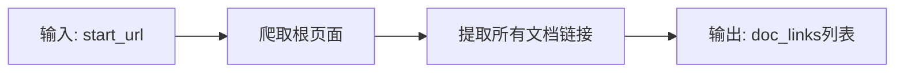
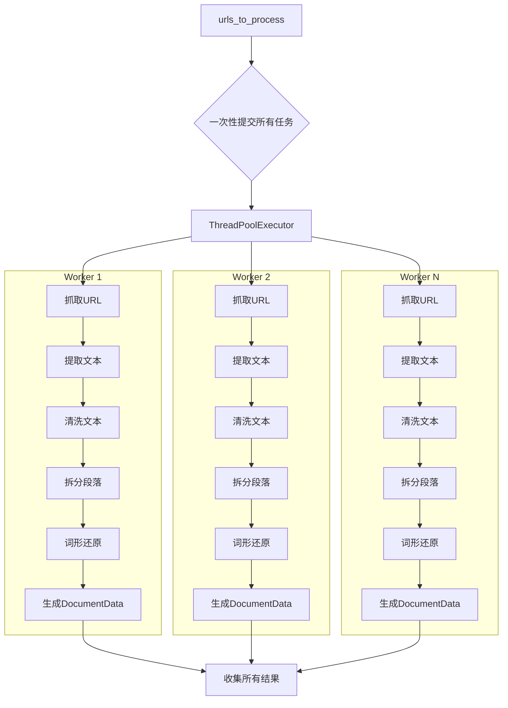
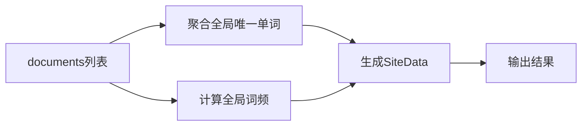

# 并行爬虫逻辑流程图

## 整体架构

```mermaid
flowchart TD
    Start([开始爬取]) --> Step1[步骤1: 爬取根页面，提取文档链接
    Step1 --> Step2[步骤2: 准备待处理URL列表]
    Step2 --> Step3[步骤3: 启动线程池，并行处理所有URL]
    Step3 --> Step4[步骤4: 聚合所有结果]
    Step4 --> End([输出结果])

    subgraph "线程池并行处理
        T1[线程1: URL1 -> 抓取 -> 解析 -> 生成文档
        T2[线程2: URL2 -> 抓取 -> 解析 -> 生成文档
        T3[线程3: URL3 -> 抓取 -> 解析 -> 生成文档
        Tn[线程N: URLn -> 抓取 -> 解析 -> 生成文档
    end

    Step3 --> T1
    Step3 --> T2
    Step3 --> T3
    Step3 --> Tn
    T1 --> Collect[收集文档]
    T2 --> Collect
    T3 --> Collect
    Tn --> Collect
    Collect --> Step4
```

## 详细流程

### 步骤1: 爬取根页面，提取文档链接



### 步骤2: 准备待处理URL列表

```mermaid
flowchart LR
    InputLinks[doc_links] --> Filter[过滤: 前N个]
    Filter --> Prepare[准备: (url, depth, doc_id)]
    Prepare --> OutputUrls[输出: urls_to_process]
```

### 步骤3: 线程池并行处理



### 步骤4: 聚合结果



## 关键改进点

1. **串行阶段**（步骤1和步骤2是串行的，确保所有URL准备好
2. **并行阶段**（步骤3）：
   - 一次性提交所有任务到线程池
   - 每个线程独立完成：抓取 → 解析 → 生成
   - 多个线程同时工作，互不干扰
3. **线程安全**：使用锁保护共享数据（documents列表）
4. **进度追踪**：实时显示完成进度

## 与旧方案对比

| 项目 | 旧方案 | 新方案 |
|------|---------|---------|
| URL收集 | 边爬边取 | 先收集全部 |
| 任务提交 | 逐个提交 | 一次性全部提交 |
| 处理方式 | 看起来串行 | 真正并行 |
| 根页面 | 当作文档处理 | 只用于提取链接 |
